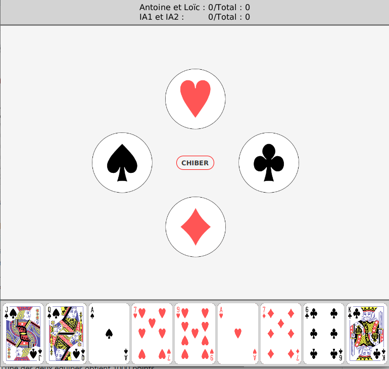

# Javass

## Table des matières
* [Description](#description)
* [Utilisation](#utilisation)
* [Fonctionnalités et implémentations](#fonctionnalités-et-implémentations)

## Description
Javass est un programme permettant de jouer au célèbre jeu du jass, codé en java lors du cours [CS-108 Pratique de la programmation orientée objet](https://cs108.epfl.ch/archive/19/archive.html) enseigné à l'EPFL lors de l'édition 2019. Il permet de jouer à la fois seul contre l'ordinateur, à plusieurs joueurs sur un même ordinateur (multi-fenêtres) ou en réseau ainsi que de manière mixte entre toutes ces possibilités.

---

## Utilisation
### Lancer une partie
Pour lancer la partie, vous pouvez simplement double cliquer sur le fichier Javass.jar dans le dossier Executable ou le lancer depuis un terminal. Lorsque le programme est lancé, une page d'accueil permettant de choisir le type de partie s'affiche.

Cette page permet tout d'abord de choisir le type de partie: locale ou distante. Si l'option locale est choisie, la partie sera hébérgé sur cette ordinateur alors que si l'option distante est choisie, l'ordinateur ouvrira une socket et attendra qu'un autre ordinateur (celui hébérgeant la partie en locale) demande de s'y connecter via TCP.
Ainsi, les joueurs distants n'ont rien de particulier à faire, mis à part choisir cette option et attendre que le joueur hébérgeant la partie ait finie d'initialiser les paramètres avec les bonnes adresses IP.
Le joueur local, quand à lui, peut choisir le type de joueurs participant à la partie. Pour chaque joueur, il peut lui donner un nom (qui, si laissé vide, sera attribué par défaut). Pour chaque joueur "humain", lors du lancement de la partie, une fenêtre de jeu s'ouvrira sur cette ordinateur. Pour chaque joueur simulé (contrôlé par l'ordinateur), un niveau de jeu peut être séléctionné. Finalement, pour chaque joueur distant, l'adresse IP de l'ordinateur en question devra être fournie pour que l'ordinateur hôte essaie de s'y connecter. Une fois tous ces paramêtres entrés, il suffit de cliquer sur le bouton "start" pour lancer la partie. Les joueurs 1 et 3 formeront une première équipe et les joueurs 2 et 4 la deuxième.

### Fin de partie
La partie se termine dès qu'une des deux équipes obtient 1000 points.

---

## Fonctionnalités et implémentations
### Choix de l'atout
Le joueur qui possède le 7 de carreau peut commencer de choisir atout lors du premier tour. Ensuite, à chaque tour, le joueur suivant peut faire atout. Pour choisir, le joueur peut simplement cliquer sur la couleur qu'il désire (pique, carreau, coeur ou trèfle) ou alors chiber et ainsi laisser son coéquipier chosir à sa place.

### Joueur simulé
Le joueur simulé utilise l'algorithme [Monte Carlo Tree Search (MCTS)](https://fr.wikipedia.org/wiki/Recherche_arborescente_Monte-Carlo). Ainsi, à chaque fois qu'un joueur simulé doit jouer une carte, il prend en compte toutes les cartes qu'il a le droit de jouer et va simuler un grand nombre de partis de façon aléatoire avec chacune de ses cartes (plus de parties seront simulés pour celles semblant plus prometteuses). Ainsi, l'ordinateur va estimer l'espérance de points que peut lui rapporter chacune de ses cartes jouables et jouera la carte lui permettant de maximiser ses points. Cependant, le joueur simulé ne prend pas en compte les informations que les autres joueurs ont pu lui donné par le passé, comme par exemple le joueur qui a choisit atout, si un joueur n'a pas suivi une couleur ou la défourche par exemple.
Pour choisir atout, la même méthode est utilisée. L'ordinateur simule donc un nombre de parties avec chaque couleur comme atout et choisit celle avec la plus grande ésperance, si celle-ci est suffisante (plus grande que l'espérance moyenne obtenu en simulant un nombre de partie très élevé avec 4 de nos joueurs simulés, soit 100.46 points), et chibe autrement.

### Joueur distant
Pour implémenter le joueur distant (pouvoir jouer en ligne sur plusieurs ordinateurs différents), l'architecture client-serveur a été choisi. Ainsi, l'ordinateur hébérgeant la partie fonctionne comme un client, et chaque fois qu'une carte devrait être joué, il va communiqué via le réseau avec le serveur fonctionnant sur l'ordinateur distant pour lui demander quelle carte doit être jouée. Pour cela, les ordinateurs utilisent une connection TCP où le serveur écoute sur le port 5108.

### Interface graphique
L'interface graphique se base sur le patron de conception [MVC (modèle-vue-contrôleur)](https://fr.wikipedia.org/wiki/Mod%C3%A8le-vue-contr%C3%B4leur) ainsi que sur les beans javafx possédant des attributs observables. Elle permet ainsi de réagir aux inputs du joueur (éclaircissement de la couleur pour le choix de l'atout lorsque l'on passe dessus avec la souris, effet de profondeur lorsque l'on choisit une carte, ...) et d'avoir un modèle à jour à tout moment en fonction des choix que font les joueurs.

